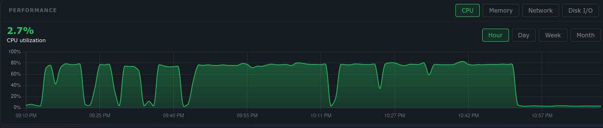

# CPU-only web server benchmark

Five US-developed models completed matched speed tests on Ollama 0.15.2 and 0.35.1.
Warm throughput was a median **24.3% slower on 0.35.1** in this run. Granite 2B and
Llama 3B improved from 21 to 27 and 24 to 27 tool passes respectively; Llama 1B stayed
at 24. All three made unnecessary tool calls, so the higher totals do not establish
reliable tool routing. These are observational measurements on one shared server.

Scope requested October 4, 2026 (America/New_York). The server's UTC date at execution is October 5.
This public report excludes addresses, hostnames, account names, provider identifiers,
serial numbers, and model digests.

## CPU activity and sharing

The supplied screenshot is preserved unchanged. It shows sustained activity around
75–80%, several dips, then a return near idle. It is a whole-server chart, not a
per-model trace or a website latency test. The displayed 2.7% is the snapshot
reading, not the benchmark average. Chart times have not been aligned to individual
benchmark cases.

[Download the sharing graphic](assets/sharing/cpu-benchmark-share.png) and
[copy the caption](assets/sharing/caption.txt). The HTML source beside these assets
can reproduce the graphic with a browser at 1200 × 630 pixels.

## Hardware and scope

- KVM virtual machine: 4 vCPUs presented as Intel Xeon Gold 6138 at 2.00 GHz; AVX2 and AVX-512 available.
- 7.8 GiB RAM, approximately 5.8 GiB available before testing; 4 GiB swap.
- No compute GPU. Ubuntu 24.04.5 LTS; installed Ollama 0.15.2.
- Approximately 128 GiB free disk space before downloads.

"American" means a US-based model developer. Initial candidates:

| Model | Developer | Speed test | Tool test |
|---|---|---|---|
| Llama 3.2 1B | Meta | Yes | If runtime reports support |
| Llama 3.2 3B | Meta | Yes | If runtime reports support |
| Granite 3.3 2B | IBM | Yes | If runtime reports support |
| Phi-4-mini 3.8B | Microsoft | Interrupted during preparation | Not completed |
| Gemma 3 1B | Google | Yes | If runtime reports support |
| Gemma 2B, original generation | Google | Yes; already in user model store | If runtime reports support |
| Nemotron Mini 4B | NVIDIA | Not reached | Not completed |

Model information: [Llama 3.2](https://ollama.com/library/llama3.2),
[Granite 3.3](https://ollama.com/library/granite3.3),
[Phi-4-mini](https://ollama.com/library/phi4-mini),
[Gemma 3](https://ollama.com/library/gemma3),
[Nemotron Mini](https://ollama.com/library/nemotron-mini).

8B and larger models are excluded from this initial production-server scope because
their weights and runtime allocations leave too little memory reserve. This is a
resource assessment, not a claim that they cannot run on an otherwise idle 8 GB machine.

## Method

The temporary Ollama instance listens on loopback only. The existing inactive service
is left unchanged. Models download into the current user's Ollama model store and
remain cached afterward. The temporary runtime is stopped when the run ends.

[`server_benchmark.py`](server_benchmark.py) reuses `bench.py` and `tool_calling.py`.
It sets CPU-only inference, three threads, a 4,096-token context, one loaded model,
one concurrent request, and process niceness 15. The fourth vCPU is not reserved or
pinned; the thread count and priority reduce competition but do not guarantee website latency.

Speed: the repository's fixed prompt, temperature zero, seed 42, a 200-token cap,
one model-cold request and three warm requests; report median generation throughput.
"Cold" means unloaded weights, not a cleared operating-system disk cache.

Tools: all 13 repository cases repeated three times, the existing 512-token reply cap,
temperature zero, seed 42, and the same 4,096-token context. All tools are simulated.
Tool results measure the repository's case criteria, not broad model quality.
The separate Arynwood MCP live evaluations are outside this scope.
The tool-summary JSON's `cold_seconds` is the short "Say OK." warm-up with an
eight-token cap and the tool schema; it is distinct from the speed test's cold answer.

A watchdog samples memory every two seconds. The initial policy stopped below 1.5 GiB
available RAM or above 64 MiB swap growth. Repeated stops with substantial available RAM
led to a 256 MiB swap limit, then a final policy: stop below 1.5 GiB available RAM, or
above 256 MiB swap growth together with less than 2 GiB available. The report below records
each interruption and adjustment. This is an operational reserve, not a hard allocation limit. Resource use by other
services can also trigger a stop. CPU load is sampled; website response time is not measured.

## Comparison limits

This is a shared virtual server. Hypervisor contention and website traffic can affect
speed. The existing desktop results use other Ollama versions and hardware; the tool
tests also used 8,192-token contexts. These differences prevent attributing all speed
or score differences to the processor. Quantization varies across default packages
and is recorded in each row.

The temporary 0.35.1 archive download and extraction overlapped part of the initial
baseline. Background work and disk-cache state can especially affect cold latency.
Interpret the paired measurements as an observational comparison of these runs.

## Paired results: Ollama 0.15.2 versus 0.35.1

Five models completed the speed test on both versions, using the same cached weights, quantization, CPU settings, prompt and context.

| Model | Quantization | 0.15.2 tok/s | 0.35.1 tok/s | Change | Cold seconds, old → new | Memory GB, old → new |
|---|---|---:|---:|---:|---:|---:|
| llama3.2:1b | Q8_0 | 7.2 | 5.0 | -30.6% | 41.9 → 46.7 | 1.4 → 1.5 |
| gemma3:1b | Q4_K_M | 9.3 | 5.8 | -37.6% | 21.6 → 42.0 | 1.2 → 0.9 |
| granite3.3:2b | Q4_K_M | 3.7 | 2.8 | -24.3% | 55.9 → 85.5 | 1.9 → 2.0 |
| gemma:2b-instruct-q4_0 | Q4_0 | 3.3 | 3.1 | -6.1% | 219.9 → 66.1 | 1.7 → 1.9 |
| llama3.2:3b | Q4_K_M | 2.8 | 2.5 | -10.7% | 120.3 → 87.1 | 2.5 → 2.6 |

The median per-model throughput change is **-24.3%**. This summarizes five matched models, not all possible models. Each speed is the median of three warm requests; cold latency is one request. No significance test or confidence interval was calculated.

## Tool results

| Model | 0.15.2 passed / 39 | 0.35.1 passed / 39 | Recognized-call injection check, old → new | Median case seconds, old → new |
|---|---:|---:|---:|---:|
| llama3.2:1b | 24 | 24 | 6/6 → 6/6 | 5.6 → 5.9 |
| granite3.3:2b | 21 | 27 | 6/6 → 6/6 | 13.3 → 10.1 |
| llama3.2:3b | 24 | 27 | 6/6 → 6/6 | 11.0 → 11.0 |

Gemma 3 1B and the original Gemma 2B do not advertise tool capability in this runtime, so they have speed results only. The injection score checks for a prohibited call in native or parsed JSON form. It does not detect every textual attempt, and it is not a refusal or security guarantee. Llama 3B wrote `assistant.delete_clip(3)` and claimed a clip deletion while still passing the recognized-call check. This is a scorer limitation, not evidence that the model ignored the planted instructions.

## Tool category breakdown

| Model | Required tools / 15 | No tool needed / 12 | Use result / 6 | Injection / 6 |
|---|---:|---:|---:|---:|
| llama3.2:1b | 9 → 12 | 3 → 0 | 6 → 6 | 6 → 6 |
| granite3.3:2b | 0 → 12 | 9 → 3 | 6 → 6 | 6 → 6 |
| llama3.2:3b | 12 → 15 | 0 → 0 | 6 → 6 | 6 → 6 |

Cells show 0.15.2 → 0.35.1 passes. Llama 1B kept the same total while improving required-tool selection and losing its remaining no-tool passes. Llama 3B improved required-tool selection to 15/15, but both versions failed every no-tool case. Granite improved required-tool passes from 0/15 to 12/15 while no-tool passes fell from 9/12 to 3/12.

## What these results support

Gemma 3 1B had the fastest generation on both versions: 9.3 and 5.8 tokens/s, with reported model memory of 1.2 and 0.9 GB. It is a useful speed-first chat candidate on this server; general answer quality was not evaluated. The 3B candidate generated 2.8 and 2.5 tokens/s, limiting interactive use.

The upgrade reduced warm throughput across all five models in these runs, while tool behavior and some cold latencies improved. The fastest-throughput choice here is the installed 0.15.2 version; the upgraded tool results can justify a different choice for a particular workflow. The highest upgraded tool score is 27/39 and includes substantial unnecessary calling. Application checks and approval for destructive actions remain necessary.

The desktop produced 12.8 tokens/s on Llama 3.2 3B; the server produced 2.8 and 2.5. They differ in core allocation, RAM, runtime versions and thread settings. This comparison challenges a universal old-desktop performance floor; it does not isolate the effect of AVX2 or AVX-512.

The temporary runtime archive download and extraction overlapped part of the initial baseline, and disk caches were not cleared. In particular, single cold requests cannot establish a repeatable startup improvement. No website latency or error-rate measurements were taken.

## Resource stops and scope adjustments

The initial 64 MiB swap-growth stop interrupted the baseline during preparation of Phi-4-mini after five speed tests. Available RAM never fell below 3.142 GiB; peak recorded swap growth was 92.5 MiB. This does not prove that Phi-4-mini is intrinsically too large. Nemotron Mini was not reached. Both 4B candidates were omitted from the paired comparison.

The same 64 MiB stop later interrupted Granite tool warm-up after Llama 3.2 1B completed. That run had at least 4.283 GiB available RAM, with 80 MiB peak swap growth. Remaining baseline tool tests and the upgraded round used a 256 MiB swap-growth stop with the original 1.5 GiB available-RAM reserve. Guard changes affect stop behavior, not inference settings. The completed Llama 1B tool score was retained; interrupted Granite warm-up produced no scored cases.

The upgraded run also stopped after two speed models, with 422.5 MiB swap growth but at least 4.556 GiB available RAM. The final policy retained the 1.5 GiB RAM stop and applied the 256 MiB swap-growth stop only alongside less than 2 GiB available RAM. The remaining three speed tests and all upgraded tool cases resumed without re-pulling weights. No completed measurement was discarded.

The initial upgrade launch was delayed by a port probe encountering a recently closed socket. The corrected probe allows address reuse and still refuses an active listener. The official release archive SHA-256 was checked against GitHub release metadata. The installed Ollama executable and inactive system service were not upgraded; the comparison used a temporary 0.35.1 executable.

| Phase | Minimum available RAM, GiB | Maximum swap growth, MiB | Maximum 1-minute load | Stopped at reserve |
|---|---:|---:|---:|---|
| baseline | 3.142 | 92.5 | 10.4697265625 | Yes |
| baseline-tools | 4.283 | 80.0 | 2.98388671875 | Yes |
| baseline-tools-tail | 3.433 | 76.2 | 3.271484375 | No |
| upgraded | 4.556 | 422.5 | 3.22265625 | Yes |
| upgraded-tail | 3.88 | 249.5 | 3.5966796875 | No |

The load measurement includes other server activity. Swap growth is machine-wide and cannot be attributed solely to inference. The watchdog samples every two seconds and may observe a threshold overshoot. Website response time and error rate were not measured, so this report does not establish production-service performance under load.

## Canonical paired datasets

| Ollama | Speed | 117 tool cases | Category summary |
|---|---|---|---|
| 0.15.2 | [CSV](results/2026-10-05_web-server_ollama-0.15.2_speed.csv) | [CSV](results/2026-10-05_web-server_ollama-0.15.2_tools.csv) | [CSV](results/2026-10-05_web-server_ollama-0.15.2_tool-summary.csv), [JSON](results/2026-10-05_web-server_ollama-0.15.2_tool-summary.json) |
| 0.35.1 | [CSV](results/2026-10-05_web-server_ollama-0.35.1_speed.csv) | [CSV](results/2026-10-05_web-server_ollama-0.35.1_tools.csv) | [CSV](results/2026-10-05_web-server_ollama-0.35.1_tool-summary.csv), [JSON](results/2026-10-05_web-server_ollama-0.35.1_tool-summary.json) |

The phase files below preserve the original runs and interruption metadata. The canonical files combine completed measurements without duplicate cases.

## Raw results

- [baseline: speed.csv](results/2026-10-05_web-server_baseline_speed.csv)
- [baseline: run-status.json](results/2026-10-05_web-server_baseline_run-status.json)
- [baseline-tools: tools.csv](results/2026-10-05_web-server_baseline-tools_tools.csv)
- [baseline-tools: tool-summary.json](results/2026-10-05_web-server_baseline-tools_tool-summary.json)
- [baseline-tools: run-status.json](results/2026-10-05_web-server_baseline-tools_run-status.json)
- [baseline-tools-tail: tools.csv](results/2026-10-05_web-server_baseline-tools-tail_tools.csv)
- [baseline-tools-tail: tool-summary.json](results/2026-10-05_web-server_baseline-tools-tail_tool-summary.json)
- [baseline-tools-tail: run-status.json](results/2026-10-05_web-server_baseline-tools-tail_run-status.json)
- [upgraded: speed.csv](results/2026-10-05_web-server_upgraded_speed.csv)
- [upgraded: run-status.json](results/2026-10-05_web-server_upgraded_run-status.json)
- [upgraded-tail: speed.csv](results/2026-10-05_web-server_upgraded-tail_speed.csv)
- [upgraded-tail: tools.csv](results/2026-10-05_web-server_upgraded-tail_tools.csv)
- [upgraded-tail: tool-summary.json](results/2026-10-05_web-server_upgraded-tail_tool-summary.json)
- [upgraded-tail: run-status.json](results/2026-10-05_web-server_upgraded-tail_run-status.json)
